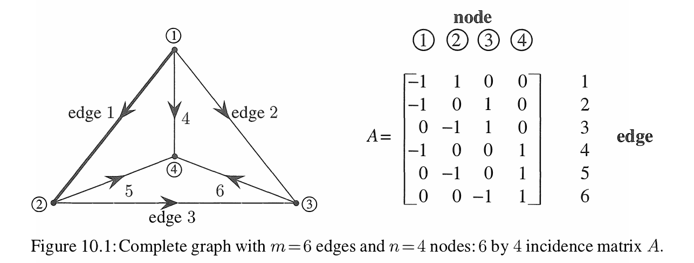

# Graphs
- The model constists of nodes connected by edges is called graph
- Graphs of the usual kind display function f(x) (need to check more)
- Graphs of node-edge kind lead to matrices

# Incidence matrix
- Incidence matrix m x n of a graph which tells how the n nodes are connected by the m edges. Normally m > m, there are more edges than nodes.
- Every entry of an incidence matrix is 0 or 1 or -1. This continues to hold during elimination (spend time on this)
- All pivots and multipliers are +/- 1  (spend time on this)
- Both factors and A = LU also contain 0, 1, -1 and so do the nullspace matrixes  (spend time on this)
- All four subspaces have bases vectors with 0, 1, -1 components
- 
- The first row -1, 1, 0, 0 shows that the f irst edge goes from node 1 to node 2 (-1 for node 1 because the arrow goes out, + 1 for node 2 with arrow in)
- A graph is a tree when its has no closed loops
- The maximum number of edges is n(n-1)/2, the minimum to stay connected is n - 1, with n is number of node
- Elimination reduces every graph to a tree.
- Loops produce dependent rows in A and zero rows in echelon forms U and R
- Rows are dependent when edges form a loop, independent rows come from trees.

## Kirchhoff's voltage law
- When x1, x2, x3, x4 are voltages at the nodes, Ax gives voltage differences.
- 
- The incidence matrix A is a diffrence matrix, the input vector x gives voltages, the output vector Ax givesvoltage differneces (along edges 1 to 6)

## Kirchhoff's current law

- The Kirchhoff's current law expresses conservation and continuity and balance. 
- Flow in equals flow out at every node
- Every loop current is solution to Current Law
- We can identify number of loops based on dimention of left null space of incidence matrix and vice versa
- 

## How can we tell if a particular vector b is in ;the column space of an incidence matrix?
- Ax is the vector of voltage differneces xi - xj. The differences add up to zero (or cancel) for a closed loop.
- Kircchoff's Voltage Law say the components of Ax = b asdd to zeor around every loop.
- By testing each loop, the voltage decides whether b is in the column space.
- Ax = b can be solved exactly when the components of b satisfy all the same dependenies as the row of A, then elimination leads to 0 = 0 and Ax = b is consistant