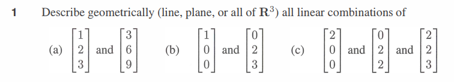

# Question 1

<b>Answer</b>

a. Two vectors v1, v2. The combinations of the first vector cv1 fills a line through (0, 0, 0) and (1, 2, 3). Combinations of the second vectors dv2 also fill that lines. So combs cv1 + dv2 fills a line in R3

b. The second vetor is not in the line filled by the combs of the first vector. So combs of the two vector fill a plane in R3

c. 3 vector *u, v, w*
The first two vectors do not have the same direction make them fill a plane.The third vector is not in the the plane filled by combs of the first two vector. Together combs of *u, v, w* will a whole R3 space

<b>Solution</b>

