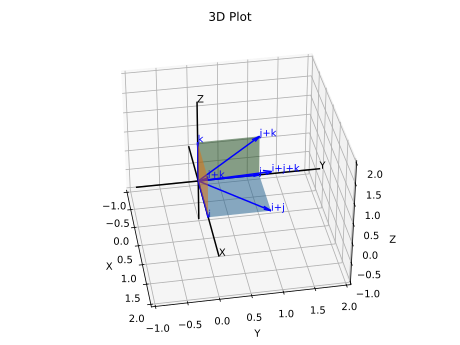

# Question 10

<b>Answer</b>

i + j = (1, 1 ,0) \
i + j + k = (1, 1, 1)\
All points in the cube are those that have their coordinate x, y, z satisfy the below conditions.
- 0 <= x <= 1
- 0 <= y <= 1
- 0 <= y <= 1

<b>Solution</b>

