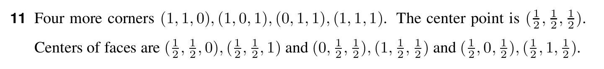

# Question 11

<b>Answer</b>

The cube has 8 corners and 10 edges.
All corners of this unit cube are:\
(0, 0, 0), (1, 0, 0), (0, 1, 0), (0, 0, 1)\
(1, 1, 0), (1, 0, 1), (0, 1, 1), (1, 1, 1)

<b>Solution</b>

