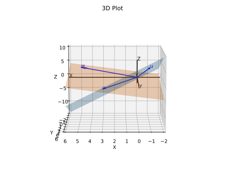

# Question 24

<b>Answer</b>

it's vector v

<b>Solution</b>

The combinations of u and v fill one plane. the combinatijons of v and w fill another plane Those planes meets in a line; only the vectors cv are in the both planes
