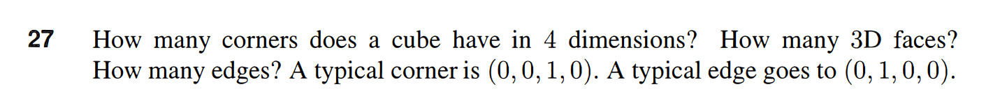
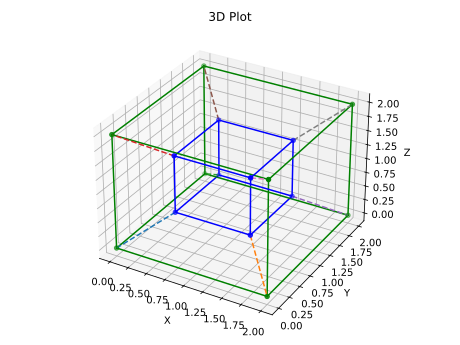
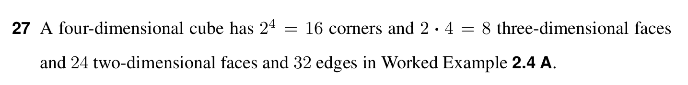

# Question 27

<b>Answer</b>

- there are 2^4 = 16 corners in the 4-D cube
- there are 16*4/2 = 32 edges
- there are 12 + 12 + 12 = 36 3d faces

<b>Solution</b>

A four-dimensional cube has 2^4 = 16 corners and 2x4 = 8 three-dimensional faces and 24 two-dimensional faces and 32 edges.
