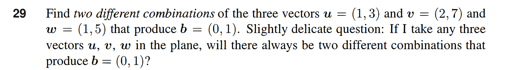
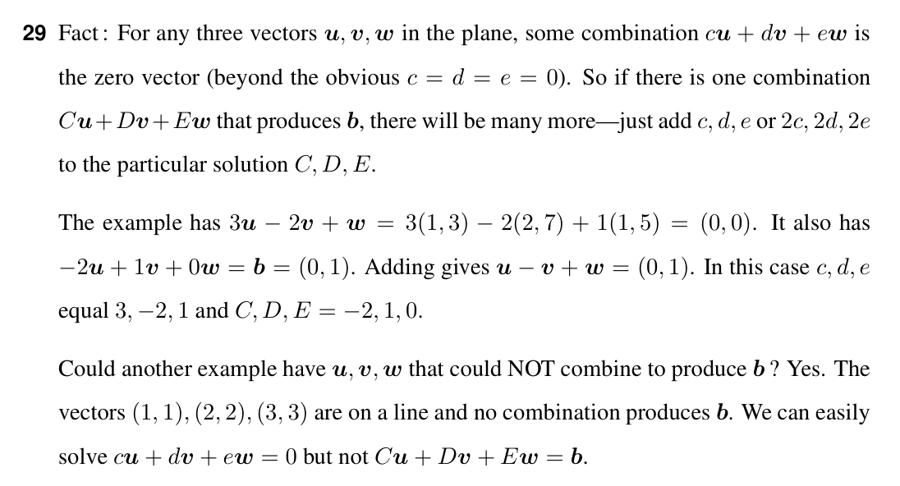

# Question 29

<b>Answer</b>

The two solutions:
(-2, 1, 0)
Full solutions: c(3, -2, 1) + (-2, 1, 0)
One solution is (-2, 1, 0) with c = 0
Another is (1, -1, 1) with c = 1

when picking any 3 vectors in the plane, there will be a few cases:
if u, v, w in the same line: if b in in the same line, infinite solutions, otherwise no solutions
if u, v, w not in the same line: there's always infinite solutions,
There's no cases that there's only 2 solutions.

<b>Solution</b>

