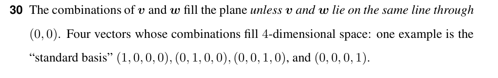

# Question 30

<b>Answer</b>

v, w file the plane unless they lie on the sample line.
The four vectors that produce all vectors (b1, b2, b3, b4) in 4D space are: (1, 0, 0, 0), (0, 1, 0, 0), (0, 0, 1, 0), (0, 0, 0, 1)

<b>Solution</b>

