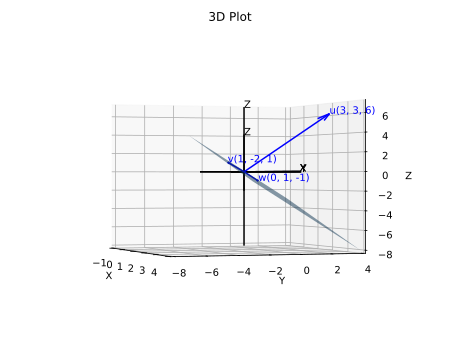
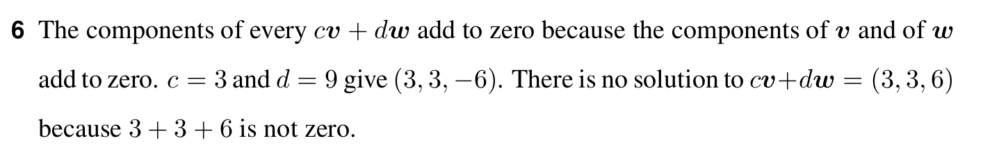

# Question 6

<b>Answer</b>

Every combination of v=(1,-2,1) and w=(0,1,-1) has components that add to a plane. There are no c and d that cv + dw = (3, 3, 6) = u because u does not lie on the vw plane.

<b>Solution</b>

The components of every cv + dw add to zero because the components of v and w add to zero
