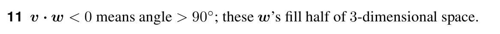

# Question 11

<b>Answer</b>

Vectors $\mathbf{v}$ and $\mathbf{w}$ form an obtuse angle.\
Plane $P$ is perpendicular to $\mathbf{v}$ at the origin $O$. On plane $P$, all vectors on the opposite side of $\mathbf{v}$ have a negative dot product with $\mathbf{v}$.

<b>Solution</b>

