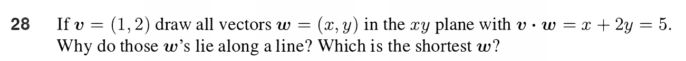

# Question 28

<b>Answer</b>

$w = (1, 2) + c(-2, 1) = (1-2c, c+2)$
$||w||^2 = (1-2c)^2 + (c+2)^2 = 4c^2 - 4c + 1 + c^2 + 4c + 4$
$ = 5c^2 + 5$
So, min length of w is $\sqrt{5}$ when c = 0

Those w's lie along a line because w's are combination of c(-2, 1) + (1,2)

<b>Solution</b>

