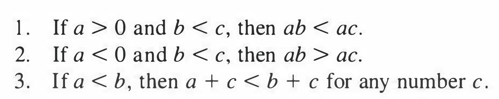

# CALCULUS
Calculus is a branch of matematics whose primary purpuse is the sutdy of motion and change.
what is a function? 
Roughly speaking, it is a rule or law that tells us how one variable quantity depends upon another

## Inequality

