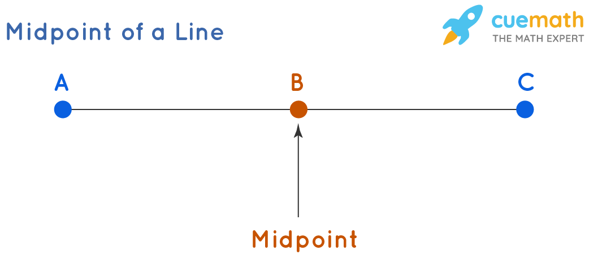
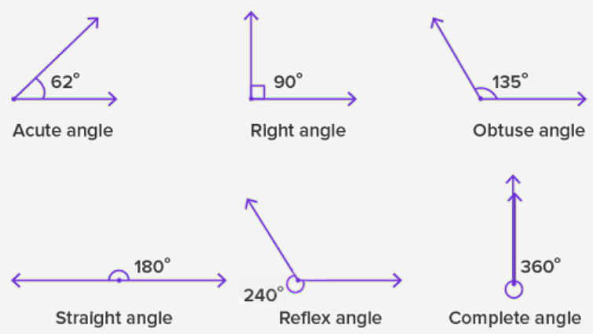
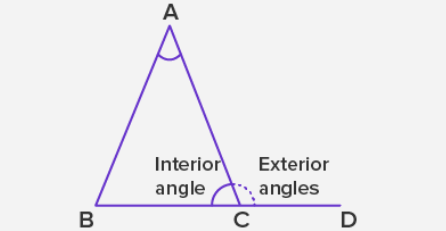

# Table of Contents <!-- omit in toc -->

<!-- TOC -->

- [Line](#line)
  - [Line, Line Segment, Ray](#line-line-segment-ray)
  - [Perpendicular and parallel lines](#perpendicular-and-parallel-lines)
- [Plane](#plane)
- [Angles](#angles)

  
# Line
## Line, Line Segment, Ray

Two line segments on a number line are congruent if they have same length.

## Perpendicular and parallel lines

# Plane
In a three-dimensional space, a plane can be defined by three points it contains, as long as those points are not on the same line

# Angles

